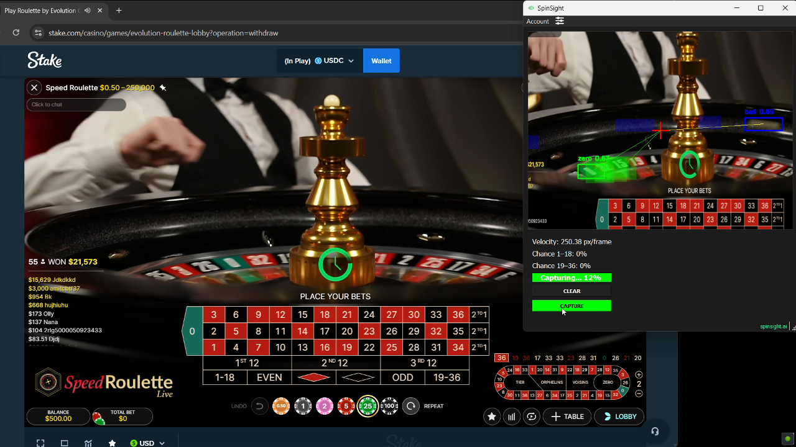

# SpinSight: AI Roulette Prediction Software

SpinSight combines advanced computer vision, physics modeling, and machine learning to predict roulette outcomes with unprecedented accuracy, giving you a genuine edge at the table.

  

## Features

- **Advanced AI Technology**: Proprietary neural networks trained on millions of real roulette spins
- **Physics-Based Prediction**: Analyzes ball velocity, wheel rotation, and physical variables in real-time
- **Proven Edge**: Consistent profits with win rates higher than random chance

## How It Works

SpinSight leverages the science of roulette physics and AI to predict outcomes:

1. **Data Collection**: Captures video feed from your screen, identifying the wheel, ball, and key reference points
2. **Real-Time Analysis**: Processes physical variables faster than any human could
3. **Prediction Generation**: Provides betting recommendations within seconds

## Quick Start Guide

### Prerequisites

- Windows 10 or 11 operating system
- Internet connection

## Documentation

For comprehensive documentation, visit [spinsight.ai/docs](https://www.spinsight.ai/docs).

## License

SpinSight is licensed under a Commercial License. Purchase of a license is required for use. See [LICENSE](LICENSE) for more information or visit [spinsight.ai/pricing](https://www.spinsight.ai/pricing) for pricing and terms.

## Support

For support, email [support@spinsight.ai](mailto:support@spinsight.ai)

## Legal Disclaimer

SpinSight is intended for educational and entertainment purposes only. Please check local laws and casino regulations before using prediction software. We are not responsible for any losses incurred while using SpinSight.
